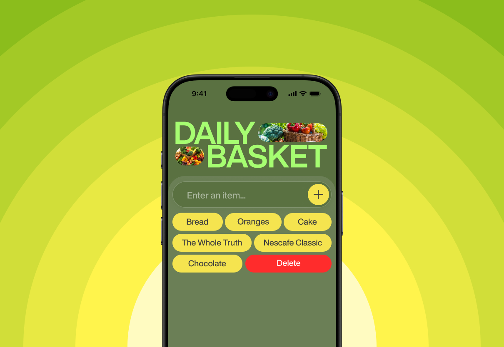

# Daily Basket 🛒

A quick and easy-to-use modern UI React app that helps you manage your grocery list. Powered by Firebase, this app allows you to add, view, and delete grocery items from your list effortlessly.

## Features

- 📋 **Add items**: Quickly add grocery items to your list.
- 🔄 **Real-time updates**: Your list syncs automatically with Firebase in real-time.
- ❌ **Delete items**: Remove items from the list with a single click.
- 🌐 **Modern UI**: Clean and responsive user interface.

## Preview



## Live Demo

Check out the live app [here](https://daily-basket-coral.vercel.app/).

## Tech Stack

- **React**: Frontend JavaScript library for building the user interface.
- **Firebase**: Real-time database to store and manage your grocery list.
- **Tailwind CSS**: Utility-first CSS framework for styling.
- **Vite**: Build tool for blazing fast development.

## Installation & Setup

To run this project locally, follow these steps:

1. Clone the repository:
   ```bash
   git clone https://github.com/vishal-dcode/Daily_Basket.git
   ```
2. Navigate to the project directory:
   ```bash
   cd daily-basket
   ```
3. Install the dependencies:
   ```bash
   npm install
   ```
4. Set up your Firebase credentials by creating a .env file in the root of your project and adding your Firebase databaseURL:
   ```bash
   VITE_FIREBASE_DATABASE_URL=https://your-firebase-database-url
   ```
5. Start the development server:
   ```bash
   npm run dev
   ```

## How to Use

1. Enter the name of the grocery item in the input field.
2. Click the "+" button to add the item to your list.
3. Click on an item to delete it from the list.

## Contributing

Feel free to submit a pull request to contribute to this project. Any suggestions or improvements are welcome!

